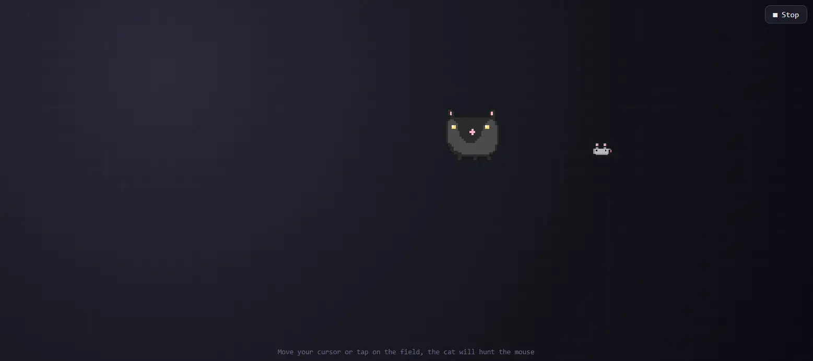

# PixelCat

A tiny pixel cat that lives in your browser and hunts your cursor like it's the last mouse on earth.



[Live Demo](https://nicohartmann.dev/pixelcat_en.html) 


## What is PixelCat?

A small, silly browser toy: click the **'Start the hunt'** button in the demo above and move your cursor through the dark window. On mobile devices, you can simply tap the area instead.

A hand-pixelled cat appears and starts chasing your cursor as if it were a tiny toy mouse dangling on an invisible string.

The cat uses simple steering behaviour: it accelerates toward the target, eases off just before pouncing, and flips horizontally the moment you swing the cursor to the other side.

Everything is drawn on two tiny canvas elements (32×32 and 16×16 pixels) that are scaled up via CSS transforms. No image files, no external libraries.

I like using these little demos in class to show how little code it actually takes to make something feel *'alive'*. Game loops, a bit of vector math and a sprinkle of pixel art. That's all there is to it.

## Features

- **Hand-pixelled cat sprite** drawn entirely on canvas, no image files needed.
- **Cursor chasing** with smooth steering behaviour: acceleration, easing, and directional flipping.
- **Dual canvas rendering** on 32×32 and 16×16 pixel elements scaled up via CSS transforms.
- **Mobile support**: tap the area instead of moving a cursor.
- **Zero dependencies**: no external libraries whatsoever.

## Tech Stack

- **HTML5**: Page structure and canvas elements.
- **CSS3**: Scaling transforms and layout styling.
- **JavaScript**: Game loop, vector math, sprite logic, and input handling.

## Getting Started

To run this project locally, follow these simple steps:

**1. Clone the Repository**

```bash
git clone https://github.com/kt-NicoHartmann/PixelCat.git
```

**2. Open the Project**

Navigate into the project directory and open the HTML file in your preferred web browser.

```bash
cd PixelCat/pixelcat_en
# On macOS/Linux:
open pixelcat_en.html
# On Windows:
start pixelcat_en.html
```

Alternatively, use an extension like **Live Server** in VS Code to host it locally.
